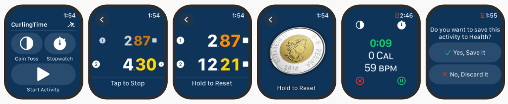

It's **Curling** time!

Our first application is a curling stopwatch, coin toss, and workout tracker for Apple Watch.

* It's pretty rare for anyone to have a coin in their pocket anymore. But that's ok, there's a coin toss built right into CurlingTime.
* Why buy a separate stopwatch when you already have one on your wrist? CurlingTime records two splits for tee-to-hog (or back-to-hog) and hog-to-hog times with big bold numbers that are easy to see while sweeping.
* And you definitely want to track your exercise in Apple Fitness, so that's built-in too.

**NOTE:** Some versions of Apple Watch will go to sleep very quickly when you turn your wrist away. You can keep CurlingTime awake while waiting to time a shot by pressing and holding anywhere on the screen.
